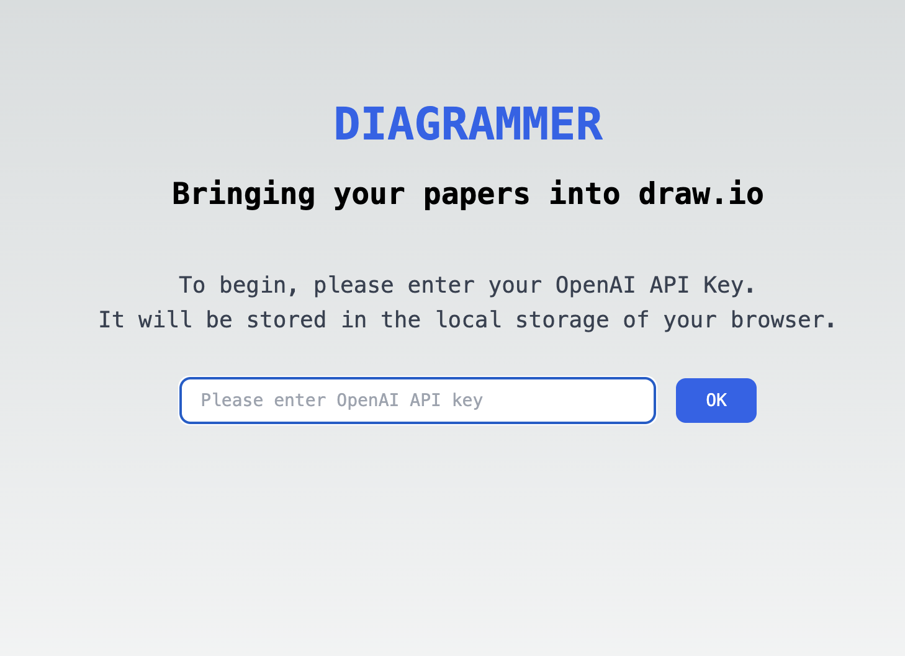

## Diagrammer



This is a Next.js project intended for testing the GPT4 Vision API.
It converts paper diagrams to Draw.io format. To test it out, you need your own OpenAI API Key.

See live demo at [https://diagrammer-ai.vercel.app/](https://diagrammer-ai.vercel.app/)

## Getting Started locally

```bash
npm install
npm run dev
```

Open [http://localhost:3000](http://localhost:3000) with your browser to see the running app.
